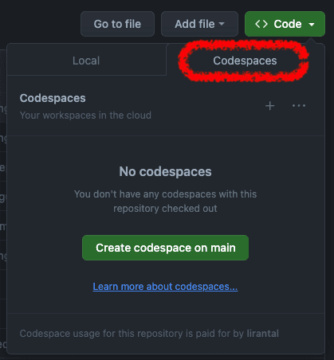

# Introduction to Programming with Python

## Step 1: Fork the Repository

To create your own copy of the repository, follow these steps:

1. **Go to the repository page**: Navigate to this GitHub repository.

### bit.ly/m3dm-intro-python

2. **Fork the repository**: 
   - In the top-right corner of the repository page, click the `Fork` button. 
   - This will create a copy of the repository under your GitHub account.
   
   

3. Navigate to your copy of the repository. Click the <> `Code` button, then click the `Codespaces` tab and create a codespace.

   

## Step 2: Download the Book

- Download the book that will be used throughout this tutorial [here](https://link.springer.com/book/10.1007/978-3-030-50356-7). We'll be discussing chapters 1 through 4.

